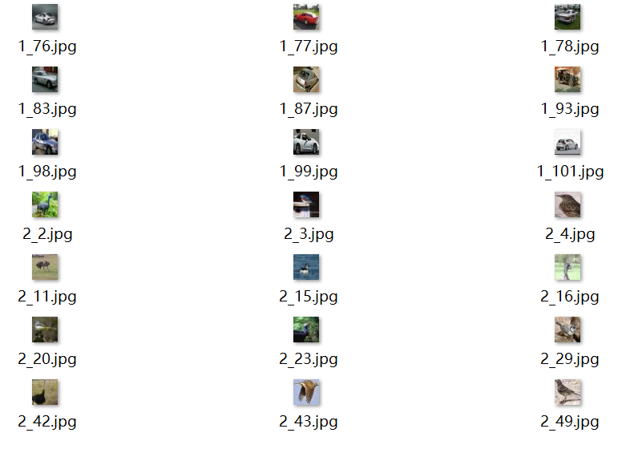

# Tensorflow-CNN-Tutorial

这是一个手把手教你用Tensorflow构建卷机网络（CNN）进行图像分类的教程。完整代码可在Github中下载：[https://github.com/hujunxianligong/Tensorflow-CNN-Tutorial](https://github.com/hujunxianligong/Tensorflow-CNN-Tutorial)。教程并没有使用MNIST数据集，而是使用了真实的图片文件，并且教程代码包含了模型的保存、加载等功能，因此希望在日常项目中使用Tensorflow的朋友可以参考这篇教程。


## 概述


+ 代码利用卷积网络完成一个图像分类的功能
+ 训练完成后，模型保存在model文件中，可直接使用模型进行线上分类
+ 同一个代码包括了训练和测试阶段，通过修改train参数为True和False控制训练和测试

## 数据准备

教程的图片从Cifar数据集中获取，`download_cifar.py`从Keras自带的Cifar数据集中获取了部分Cifar数据集，并将其转换为jpg图片。

默认从Cifar数据集中选取了3类图片，每类50张图，分别是
+ 0 => 飞机
+ 1 => 汽车
+ 2 => 鸟

图片都放在data文件夹中，按照label_id.jpg进行命名，例如2_111.jpg代表图片类别为2（鸟），id为111。




## 导入相关库

除了Tensorflow，本教程还需要使用pillow(PIL)，在Windows下PIL可能需要使用conda安装。

如果使用`download_cifar.py`自己构建数据集，还需要安装keras。


```python
import os
#图像读取库
from PIL import Image
#矩阵运算库
import numpy as np
import tensorflow as tf
```

## 配置信息

设置了一些变量增加程序的灵活性。图片文件存放在`data_dir`文件夹中，`train`表示当前执行是训练还是测试，`model-path`约定了模型存放的路径。

```python
# 数据文件夹
data_dir = "data"
# 训练还是测试
train = True
# 模型文件路径
model_path = "model/image_model"
```

## 数据读取

从图片文件夹中将图片读入numpy的array中。这里有几个细节：

+ pillow读取的图像像素值在0-255之间，需要归一化。
+ 在读取图像数据、Label信息的同时，记录图像的路径，方便后期调试。

```python

# 从文件夹读取图片和标签到numpy数组中
# 标签信息在文件名中，例如1_40.jpg表示该图片的标签为1
def read_data(data_dir):
    datas = []
    labels = []
    fpaths = []
    for fname in os.listdir(data_dir):
        fpath = os.path.join(data_dir, fname)
        fpaths.append(fpath)
        image = Image.open(fpath)
        data = np.array(image) / 255.0
        label = int(fname.split("_")[0])
        datas.append(data)
        labels.append(label)

    datas = np.array(datas)
    labels = np.array(labels)

    print("shape of datas: {}\tshape of labels: {}".format(datas.shape, labels.shape))
    return fpaths, datas, labels


fpaths, datas, labels = read_data(data_dir)

# 计算有多少类图片
num_classes = len(set(labels))
```

## 定义placeholder(容器)

除了图像数据和Label，Dropout率也要放在placeholder中，因为在训练阶段和测试阶段需要设置不同的Dropout率。

```python
# 定义Placeholder，存放输入和标签
datas_placeholder = tf.placeholder(tf.float32, [None, 32, 32, 3])
labels_placeholder = tf.placeholder(tf.int32, [None])

# 存放DropOut参数的容器，训练时为0.25，测试时为0
dropout_placeholdr = tf.placeholder(tf.float32)
```

## 定义卷基网络（卷积和Pooling部分）
```python
# 定义卷积层, 20个卷积核, 卷积核大小为5，用Relu激活
conv0 = tf.layers.conv2d(datas_placeholder, 20, 5, activation=tf.nn.relu)
# 定义max-pooling层，pooling窗口为2x2，步长为2x2
pool0 = tf.layers.max_pooling2d(conv0, [2, 2], [2, 2])

# 定义卷积层, 40个卷积核, 卷积核大小为4，用Relu激活
conv1 = tf.layers.conv2d(pool0, 40, 4, activation=tf.nn.relu)
# 定义max-pooling层，pooling窗口为2x2，步长为2x2
pool1 = tf.layers.max_pooling2d(conv1, [2, 2], [2, 2])
```

## 定义全连接部分
```python
# 将3维特征转换为1维向量
flatten = tf.layers.flatten(pool1)

# 全连接层，转换为长度为100的特征向量
fc = tf.layers.dense(flatten, 400, activation=tf.nn.relu)

# 加上DropOut，防止过拟合
dropout_fc = tf.layers.dropout(fc, dropout_placeholdr)

# 未激活的输出层
logits = tf.layers.dense(dropout_fc, num_classes)

predicted_labels = tf.arg_max(logits, 1)
```

## 定义损失函数和优化器

这里有一个技巧，没有必要给Optimizer传递平均的损失，直接将未平均的损失函数传给Optimizer即可。

```python
# 利用交叉熵定义损失
losses = tf.nn.softmax_cross_entropy_with_logits(
    labels=tf.one_hot(labels_placeholder, num_classes),
    logits=logits
)
# 平均损失
mean_loss = tf.reduce_mean(losses)

# 定义优化器，指定要优化的损失函数
optimizer = tf.train.AdamOptimizer(learning_rate=1e-2).minimize(losses)
```

## 定义模型保存器/载入器
如果在比较大的数据集上进行长时间训练，建议定期保存模型。
```python
# 用于保存和载入模型
saver = tf.train.Saver()
```

## 进入训练/测试执行阶段
```python
with tf.Session() as sess:
```

在执行阶段有两条分支：
+ 如果trian为True，进行训练。训练需要使用`sess.run(tf.global_variables_initializer())`初始化参数，训练完成后，需要使用`saver.save(sess, model_path)`保存模型参数。
+ 如果train为False，进行测试，测试需要使用`saver.restore(sess, model_path)`读取参数。

## 训练阶段执行
```python
if train:
       print("训练模式")
       # 如果是训练，初始化参数
       sess.run(tf.global_variables_initializer())
       # 定义输入和Label以填充容器，训练时dropout为0.25
       train_feed_dict = {
           datas_placeholder: datas,
           labels_placeholder: labels,
           dropout_placeholdr: 0.25
       }
       for step in range(150):
           _, mean_loss_val = sess.run([optimizer, mean_loss], feed_dict=train_feed_dict)
           if step % 10 == 0:
               print("step = {}\tmean loss = {}".format(step, mean_loss_val))
       saver.save(sess, model_path)
       print("训练结束，保存模型到{}".format(model_path))
```

### 测试阶段执行
```python
else:
    print("测试模式")
    # 如果是测试，载入参数
    saver.restore(sess, model_path)
    print("从{}载入模型".format(model_path))
    # label和名称的对照关系
    label_name_dict = {
        0: "飞机",
        1: "汽车",
        2: "鸟"
    }
    # 定义输入和Label以填充容器，测试时dropout为0
    test_feed_dict = {
        datas_placeholder: datas,
        labels_placeholder: labels,
        dropout_placeholdr: 0
    }
    predicted_labels_val = sess.run(predicted_labels, feed_dict=test_feed_dict)
    # 真实label与模型预测label
    for fpath, real_label, predicted_label in zip(fpaths, labels, predicted_labels_val):
        # 将label id转换为label名
        real_label_name = label_name_dict[real_label]
        predicted_label_name = label_name_dict[predicted_label]
        print("{}\t{} => {}".format(fpath, real_label_name, predicted_label_name))
```
